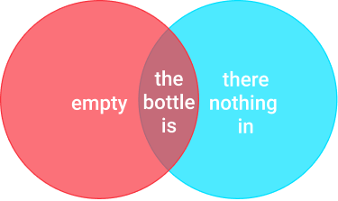
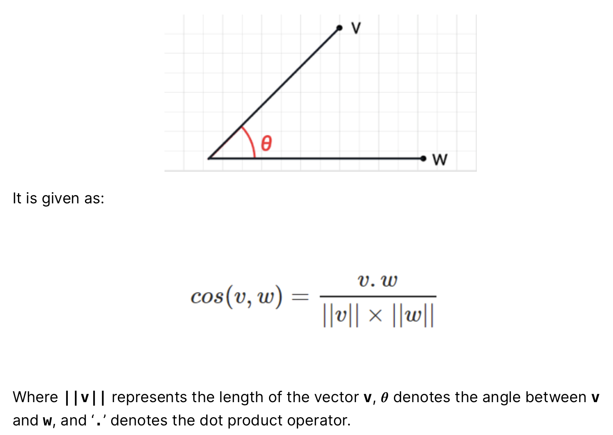
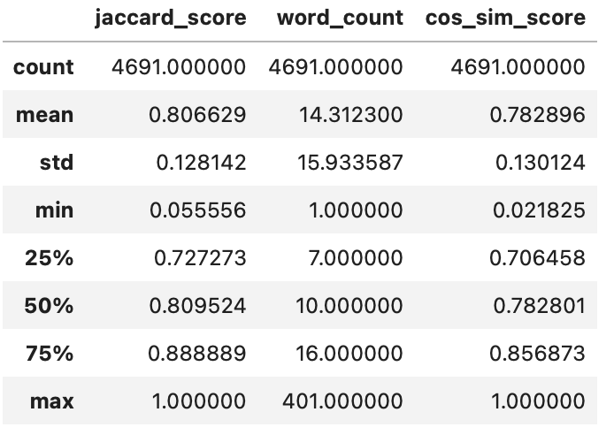
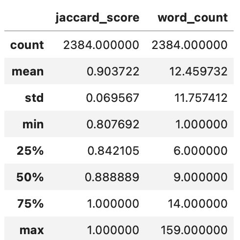
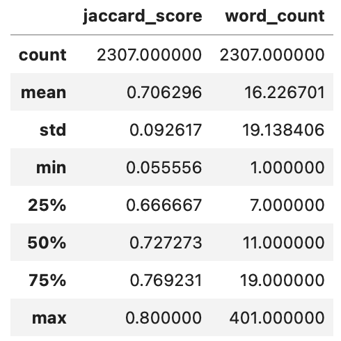
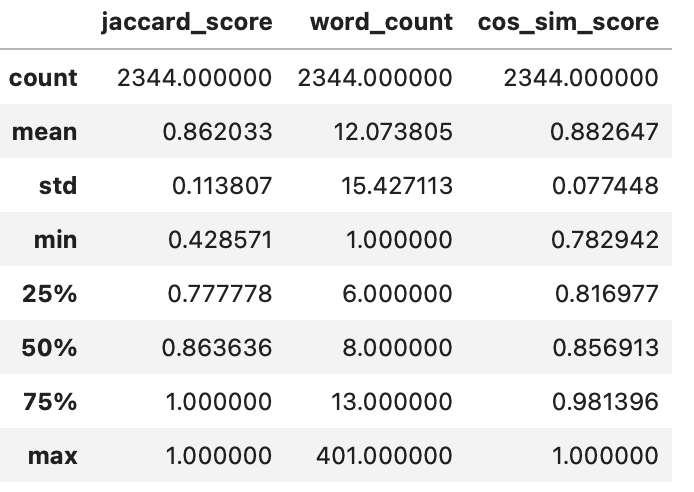

Review Generation using GPT2
==============================

Author: Santosh Yadaw | [LinkedIn](https://www.linkedin.com/in/santosh-yadaw-b32025111/) | [Github](https://github.com/SantoshYadaw/)

Overview
------------

In this project, we aim to train a gpt2 open source model on amazon review dataset.

Project Organization
------------

    ├── README.md          <- The top-level README for developers using this project.
    ├── data
    │   ├── interim        <- Intermediate data that has been transformed.
    │   ├── processed      <- The final, canonical data sets for modeling.
    │   └── raw            <- The original, immutable data dump.
    │
    ├── docs               <- A default Sphinx project; see sphinx-doc.org for details
    │
    ├── models             <- Trained and serialized models, model predictions, or model summaries
    │
    ├── notebooks          <- Jupyter notebooks. 
    │
    │
    ├── setup.yml   <- The requirements file for reproducing the analysis environment
    │
    ├── src                <- Source code for use in this project.
    │   ├── __init__.py    <- Makes src a Python module
    │   │
    │   ├── data           <- Scripts to download or generate data
    │   │   └── make_dataset.py
    │   │
    │   ├── models         <- Scripts to train models and then use trained models to make
    │   │   │                 predictions
    │   │   ├── predict_model.py
    │   │   └── train_model.py
    │   │

--------

Environment Setup
------------
1. Build the necessary environment to run the code
```conda env create -f setup.yml```

2. Ensure your have downloaded the dataset from the repo and it is placed under data > raw folder.


Usage via Notebook
------------
Run the notebooks in the order below to perform EDA, Model training and Model evaluation

1. [01_eda.ipynb](notebooks/01_eda.ipynb)
2. [02_train_gpt2.ipynb](notebooks/02_train_gpt2.ipynb)
3. [03_predict_gpt2.ipynb](notebooks/03_predict_gpt2.ipynb)

Usage via Scripts
------------
If you wish to run via the python scripts, run them in the following order

1. Preprocess the raw data:
``` python -m src.data.make_dataset ```

2. Train the gpt2 model:
``` python src.models.train_model ```

3. Call inference using trained gpt2 model:
``` python src.models.predict_model ```

Exploratory Data Analysis
------------

Exploratory Data Analysis notebook can be found in [01_eda.ipynb](notebooks/01_eda.ipynb). Please refer to the notebook for the details.


Evaluation Metrics
------------
The Evaluation notebook can be found in [03_predict_gpt2.ipynb](notebooks/03_predict_gpt2.ipynb). Two evaluation metrics were considered to evaluate the output from the trained gpt2 model against the original given text in the validation dataset.

1. Jaccard Similarity

Jaccard similarity coefficient basically treats the data objects like sets. It is defined as the size of the intersection of two sets divide by the size of the union. We use this as a way to measure how many words that is generated by gpt2 is identical to the original words in the sentence. The higher the ratio means the more similar the words are.

<p align="center">
  
  <br>                  
</p>

2. Word2vec Embeddings Cosine Similarity 

One of the pitfalls of using jaccard similarity is it does not take into account the symatic meaning of the sentences. As language, there are many ways to express things and likewise, certain sentences can the same meaning but can be written in a different way. Hence we can make use of the idea of embedding and calculate the cosine similarity (which is the measure of the similarity between two vectors) between the original and gpt generated text. 

Cosine similarity computes the similarity of two vectors as the cosine of the angle between two vectors. It determines whether two vectors are pointing in roughly the same direction. So if the angle between the vectors is 0 degrees, then the cosine similarity is 1.

To calculate this, we will use a pretrained word2vec model to generate the embeddings of the original text and the gpt2 generated text. Then we will compare the embeddings via cosine similarity.

<p align="center">
  
  <br>                  
</p>

Model's Performance
------------
More indepth analysis of the performance performance can be found in [03_predict_gpt2.ipynb](notebooks/03_predict_gpt2.ipynb).

GPT2 Evaluation Results Summary
<p align="center">
  
  <br>                  
</p>

a. Overall observation using Jaccard Similarity Score

1. From the above summary, the average jaccard similarity score calculated on the validation set is 0.8 with min score of 0.05 and max score of 1.0. This means the generated text on average are only 80% similar to the original text which seems to indicate a pretty good score.
2. In general, the jaccard score is higher for given sentences that are shorter in length.
3. The limitation with jaccard similiarity:
- is it does not capture the magnitude or direction of the vectors and hence it may not reflec the strength of the similarity
- Does not consider the order or the context of the words and it may miss semantic variations that could be generated by gpt2

Statistics of samples with higher than average jaccard score
<p align="center">
  
  <br>                  
</p>

Statistics of samples with low than average jaccard score
<p align="center">
  
  <br>                  
</p>


b. Overall observations on Cosine Similarity Score

1. From the above summary, the average cosine similarity score between the original and gpt2 generated text on validation data is around 0.78 with min score of 0.02 and maximum score 1.0
2. Similar to jaccard similarity score, the cosine similarity score of the gpt2 generated text is higher when the original sentences have less words

Statistics of samples with high than average cosine similarity score
<p align="center">
  
  <br>                  
</p>

Statistics of samples with lower than average cosine similarity score
<p align="center">
  
  <br>                  
</p>

Future Work
------------
- [ ] Write test cases for function
- [ ] Overall we can see the generated text are not quite identical to the original text. This is expected since we only trained the model on 6 epochs and the loss had not yet converged. Hence we can try to train the model until convergence.
- [ ] Maybe we can try to retrain the model using a reviews dataset first and then use the current dataset and fine tune it.
- [ ] Using pretraind word2vec may not be the best way to measure and evaluate the quality of the text generated since its a quantitative approach. Perhaps incorporating a more qualitiative approach too might be needed to fully evaluate the gpt2 generated text - coherence etc, BLEU or ROGUE
- [ ] Using sentence transformers to generate embeddings rather than word2vec.

References
------------
- https://huggingface.co/gpt2